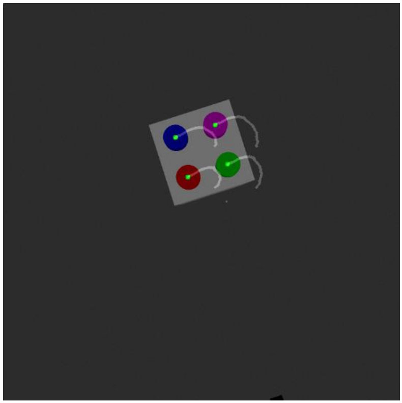

# Visual Servoing
### Azzam Shaikh

This repo contains an implementation of a visual servoing algorithm to move a 2 link (revolute) robot from an initial pose to a reference, goal pose, as shown below.


The algorithm controls the robot to move to the goal position via the trajectory shown in the image below.



## Building the Workspace

Extract the `src` folder to a clean directory. 

In the parent folder of the `src` directory, run the following command:

```
colcon build && source install/setup.bash
```

## Running the code

Run the following command in the terminal:

```
ros2 launch rrbot_gazebo visual_servoing.launch.py
```

